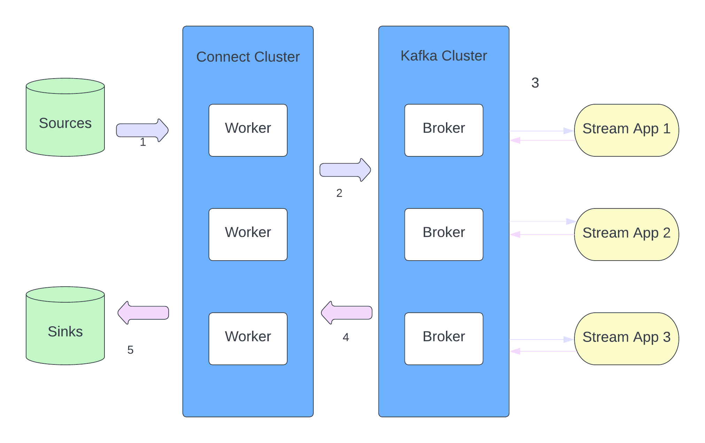
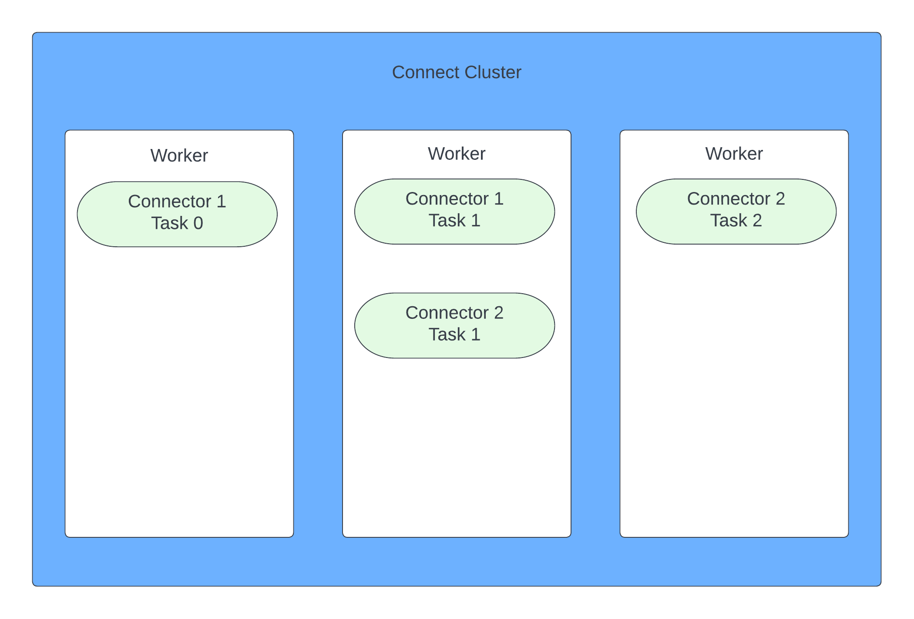

# Kafka

[Official Doc](https://kafka.apache.org/documentation/#gettingStarted)

---
---

## Kafka Theory

### Broker & Topic

#### Broker
* A Kafka cluster is composed of multiple brokers (servers).
* Each broker contains certain topic partitions.
* After connecting to any broker (called a bootstrap broker), you will be connected to the entire cluster.
* Each broker knows about all brokers, topics and partitions. (metadata)

#### Topic
* A particular stream of data.
* A topic is identified by its name. Any kind of message format.
* The sequence of messages is called a data stream.
* Immutable: once data is written to a partition, it cannot be changed. 
* Data is kept only for a limited time (default is 1 week - configurable).

#### Partition & Offset
* A topic is split into partitions. 
* Messages within each partition are ordered. 
* Each message within a partition gets an incremental id, called offset.
    * Offsets are not re-used even if previous messages have been deleted.
    * Order is guaranteed only within a partition.

#### Replication
* Leader-Follower model
  * At any time only 1 broker can be a leader for a given partition.
  * Producers can only send data to the broker that is leader of a partition.
  * By default:
    * Producers only write to the leader broker.
    * Consumers will read from the leader broker.
  * Consumer Replica Fetching
    * It's possible to config consumers to read from the closest replica.

---

### Producer
* Producers write data to topics.
* Producers know to which partition to write to (and which Kafka broker has it).
* In case of Kafka broker failures, producers will automatically recover.

#### Message Key
* Producers can optionally choose to send a key with the message.
* If key == null, data is sent round-robin to partitions; Else, all messages for that key will always go to the same partition(hashing)

#### Message Serializer
* kafka only accepts bytes as input from producers, and sends bytes out as an output to consumers.
* Serializers are only used on the value and the key.

#### ACKs
* Producers can choose to receive ACK of data writes:
  * acks=0, Producers won't wait for ACK
    * Producers consider message as 'written successfully' the moment the message was sent without waiting for the broker to accept it. 
  * acks=1, Producers will wait for leader's ACK
    * Default for Kafka v1.0 to v2.8.
  * acks=all / acks=-1, Leader + Replica's ACK
    * Default for Kafka 3.0+
    * The leader checks to see if there are enough in-sync replicas for safely writing the message 
      * controlled by the broker setting `min.insync.replicas`
        * eg. min.insync.replicas=2: at least leader and 1 replica need to ack

#### Producer Retries
* In case of transient failures, developers are expected to handle exceptions; otherwise data will be lost.
* There's a `retries` setting
  * defaults to 0 for Kafka <= 2.0
  * defaults to Integer.MAX_VALUE for Kafka >= 2.1
* The `retry.backoff.ms` is by default 100 ms
* Retries are bounded by a timeout, since Kafka 2.1, you can set: `delivery.timeout.ms=120000`(2 min)

#### Idempotent Producer
* The producer can introduce duplicate messages in Kafka due to network errors
* They are default since Kafka 3.0, `enable.idempotence=true`
* They come with:
  * retries=Integer.MAX_VALUE
  * max.in.flight.request=5 (Kafka >= 1.0)
  * acks=all

#### Message Compression at Producer
* Compression on a batch of messages.
* `compression.type` can be none(default), gzip, lz4, snappy, zstd
* Consider tweaking `linger.ms` and `batch.size` to have bigger batches.
  * By default, Kafka producers try to send records ASAP.
  * linger.ms (default 0): how long to wait till we send a batch.
  * batch.size (default 16KB): if a batch is filled before linger.ms, increase the batch size.

---

### Consumer
* Consumers read data from a topic - pull model.
* Consumers automatically know which broker to read from.
* In case of broker failures, consumers know how to recover.
* Data is read in order from low to high offset within each partition.

#### Message Deserializer
* Transform bytes into objects / data.
* Deserializers are only used on the value and the key.

#### Consumer Offset
* Kafka stores the offset at which a consumer group has been reading.
* When a consumer in a group has processed data received from Kafka, it should be periodically committing the offsets.
* If a consumer dies, it will be able to read back from where it left off thanks to the committed consumer offsets. 

#### Consumer Group
* Each consumer within a group reads from exclusive partitions of a topic. 
* If you have more consumers than partitions, some consumers will be inactive.
* Can have multiple consumer groups on the same topic.

* Partition Re-balance
  * Re-balance happens when a consumer leaves or joins a group. Also happens if admin adds new partition into a topic.
  * Eager Re-balance
    * All consumer stops, give up their membership of partitions.
    * They re-join the consumer group and get a new partition assignment.
    * Consumers don't necessarily get back the same partitions as they used to.
  * Cooperative Re-balance (Incremental Re-balance)
    * Reassigning a small subset of partitions from one consumer to another.
    * Other consumers that don't have reassigned partitions can still process uninterrupted.
    * Can go through several iterations to find a 'stable' assignment.

* Static Membership
  * By default, when a consumer leaves a group, its partitions are revoked and re-assigned.
  * If it joins back, it will have a new 'member ID' and new partitions assigned.
  * If you specify group.instance.id, it makes the consumer a static member.
  * Upon leaving, the consumer has up to session.timeout.ms to join back and get back its partitions, without triggering a re-balance. 

#### Delivery Semantics
* At least once
  * Offsets are committed after the message is processed.

* At most once
  * Offsets are committed as soon as messages are received.

* Exactly once
  * Can be achieved for Kafka => Kafka workflows using the Transactional API.
  * For Kafka => Sink workflows, use an idempotent consumer.

---
---

## CLI Commands
[commands.md](CLI_commands.md)

---
---

## Kafka Connect

* What is Kafka Connect?
  * Simplify and improve getting data in and out of Kafka.
  * Source => Kafka | Producer API | Kafka Connect Source
  * Kafka => Sink / App | Consumer API | Kafka Connect Sink
* Definitions:
  * Kafka Connect Cluster has multiple loaded **Connectors**
    * Each connector is a re-usable piece of code (java jars)
    * Many connectors exist in the open source world, leverage them
  * Connectors + **User Configuration** => **Tasks**
    * A task is linked to a connector config
    * A job config may spawn multiple tasks
  * Tasks are executed by Kafka Connect **Workers**(servers)
    * A worker is a single java process
    * A worker can be standalone or in a cluster

* 2 modes for Kafka Connect Deployment
  * Standalone
    * A single process runs your connectors and tasks
    * Config is bundled with your process
    * Not fault-tolerant, no scalability, hard to monitor

  * Distributed
    * Multiple workers run your connectors and tasks
    * Config is submitted using a REST API
    * Easy to scale, and fault-tolerant (re-balancing in case a worker dies)

  

---
---

## Kafka Stream
* Solves transformations Kafka => Kafka
  * Kafka => Kafka | Consumer, Producer API | Kafka Streams
* Easy data processing and transformation lib within Kafka
  * Standard Java Application
  * No need to create a separate cluster
  * Highly scalable, elastic and fault-tolerant
  * Exactly once capabilities
  * One record at a time processing (no batching)
    * Spark and Flink are micro-batching processing
  * Works for any application size

* Terminologies
  * A **stream** is a seq of immutable data records, that fully ordered, can be replayed, and is fault-tolerant
  * A **stream processor** is a nde in the processor topology. It transforms incoming streams, record by record, and may create a new stream from it.
    * A **source processor** is a special processor that takes its data directly from a Kafka topic. It has no predecessors in a topology, and doesn't transform data.
    * A **sink processor** is a processor that doesn't have children, it sends the stream data directly to a Kafka topic.
  * A **topology** is a graph of processors chained together by streams.

* Concepts
  * KStreams
    * All inserts, similar to a log
    * Infinite, unbounded data streams
  ~~~
  Topic (key, value)              KStreams
  (alice, 1)              |       (alice, 1)
                          |
  (marc, 4)               |       (alice, 1)
                          |       (marc, 4)
                          |
  (alice, 2)              |       (alice, 1)
                          |       (marc, 4)
                          |       (alice, 2)
  ~~~
  
  * KTables
    * All upserts on non-null
    * Deletes on null values
    * Similar to a table
    * Parallel with log compacted topics
  ~~~
  Topic (key, value)              KTables
  (alice, 1)              |       (alice, 1)
                          |
  (marc, 4)               |       (alice, 1)
                          |       (marc, 4)
                          |
  (alice, 2)              |       (alice, 2)
                          |       (marc, 4)
                          |     
  (marc, null)            |       (alice, 2)
                          |       # marc is deleted 
  ~~~
  
  * When to use: KStreams v.s KTables
    * KStreams reading from a topic that's not compacted; KTable reading from a topic that's log-compacted(aggregations)
    * KStreams if new data is partial information / transactional; KTables more if you need a structure that's like a DB table, where every update is self-sufficient.

  
  * Stateless v.s. Stateful operations
    * Stateless: the result of a transformation only depends on the data-point you process
    * Stateful: the result of a transformation also depends on an external information

    * Stateless Operations
      * `mapValues() / map()`
        * Takes 1 record and produces 1 record.
        * mapValues():
          * affects values (does not change keys == does not trigger a re-partition)
          * for KStreams and KTables
        * map():
          * affects both keys and values (trigger a re-partition)
          * for KStreams only
      * `filter() / filterNot()`
        * Takes 1 record and produces 0 or 1 record.
        * filter():
          * does not change keys / values (does not trigger a re-partition)
          * for KStreams and KTables
        * filterNot():
          * inverse of filter()
      * `faltMapValues() / flatMap()`
        * Takes 1 record and produces 0 or 1 or more record.
        * `flatMapValues()`
          * does not change keys (does not trigger a re-partition)
          * for KStreams only
          ~~~java
          // split s sentence into words
          KStreams<String, String> words = sentences.flatMapValues(value -> Arrays.asList(value.split("\\s+")));
          ~~~
          ~~~
          (alex, alex is nice) 
          =>
          (alex, alex)
          (alex, is)
          (alex, nice)
          ~~~
        * `flatMap()`
          * change keys 
          * for KStreams only
      * `branch()`
        * branch() splits a KStream based on 1 or more predicates
        * Predicates are evaluated in order, if no matches, records are dropped
        ~~~java 
        KStream<String, Long>[] branches = stream.branch(
          (k, v) -> v > 100, // 1st branch
          (k, v) -> v > 10, // 2nd branch
          (k, v) -> v > 0 // 3rd branch
        );
        ~~~
        ~~~
        data stream         branch[0]         branch[1]         branch[2]         dropped
        (alex, 1)           (alex, 200)       (alex, 20)        (alex, 1)         (alex, -10)
        (alex, 20)                                              (alex, 9)
        (alex, 200)
        (alex, 9)
        (alex, -10)
        ~~~
      * `selectKey()`
        * assign a new key to the record (from old key and val) (trigger re-partition)
        * best practice is to isolate that transformation to know exactly where the partition happens

      * Read from Kafka
        * as KStream
        ~~~java
        KStream<String, Long> wordCounts = builder.stream(
          Serdes.String(), // key
          Serdes.Long(), // val
          "word-count-input-topic" // input topic
        );
        ~~~
        * as KTable
          ~~~java
          KTable<String, Long> wordCounts = builder.table(
            Serdes.String(), // key
            Serdes.Long(), // val
            "word-count-input-topic" // input topic
          );
          ~~~
        * as GlobalKTable
          ~~~java
          GlobalKTable<String, Long> wordCounts = builder.globalTable(
            Serdes.String(), // key
            Serdes.Long(), // val
            "word-count-input-topic" // input topic
          );
          ~~~
        
      * Write to Kafka
        * write KStream or KTable
          * To: terminal operation - write the records to a topic
          ~~~java
          stream.to("output-topic");
          table.to("output-topic");
          ~~~
          * Through: write to a topic and get a stream / table from the topic
          ~~~java
          KStream<String, Long> newStream = stream.through("user-clicks-topic");
          KTable<String, Long> newTable = table.through("user-clicks-topic");
          ~~~

      * KStream <=> KTable
      ~~~java
      // table -> stream
      KTable<byte[], String> stream = table.toStream();
      
      // stream -> table
      // option 1: groupByKey() + aggregation
      KTable<String, Long> table = stream.groupByKey().count();
      // option 2: write back to Kafka & read as KTable
      stream.to("temp-topic");
      KTable<String, Long> table = builder.table("temp-topic");
      ~~~
---
---

## Kafka Schema Registry
* Using Schema in Kafka